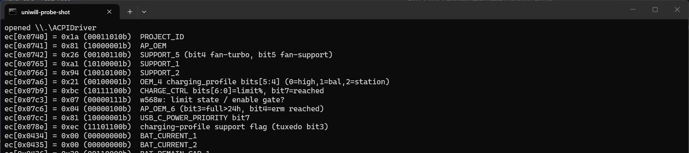

# uniwill-ec-charge-limit

修复同方（Uniwill/Tongfang）模具笔记本"设置了充电上限却不生效"的 EC 固件问题。

实测机型：机械革命蛟龙 16 Pro 2025（JIAOLONG，8945HX + RTX 5070 Ti，BIOS `N.1.21MRO34`，EC `1.32`）。
原理上适用于所有使用 Uniwill EC + `UWACPIDriver.sys` / WMI `AcpiTest_MULong` 接口的机型（机械革命、XMG、TUXEDO、Eluktronics 等同模具家族），但**不同机型的 EC 固件行为可能不同，请先只读验证**。

> ⚠️ **本项目是逆向分析记录，不是开箱即用的限电工具。** 门控字节是产品身份的一部分，写错可能带来键盘映射等副作用；~2020 代老机型上启用限充**可能永久损坏电池**（CVE-2026-64143）。详见[免责说明](#-关于这不是一个立即可用的限电方案)。

> English version: [README_EN.md](README_EN.md) · English research notes: [docs/RESEARCH_EN.md](docs/RESEARCH_EN.md)



---

## 症状

- 在官方控制台 / OpenRevo 里设置了充电上限（如"工作站模式 60%"），EC 寄存器 `0x07B9` 也确实被写成了 `0x3C`
- 但电池照样充到 100%

## 根因

EC 固件每秒执行的充电控制循环开头有一个平台门控（来自 [w568w 的固件逆向](https://gist.github.com/w568w/957976b59906e0ce5d6c13ad342e1593)）：

```c
state_is(v) = (xram[0x07C3] == v) || (xram[0x0770] == v);
limit_enabled = state_is(4) || state_is(5);

if (!limit_enabled) {
    stored_limit = xram[0x087F] & 0x7f;
    if (stored_limit == 0 || stored_limit > 100) {
        disable_control();   // 本机永远走这里
        return;
    }
}
enable_control();  // 使用 live limit xram[0x07B9]
store_limit();
```

`0x0770` 即 Linux 驱动中的 **`EC_ADDR_ROMID_START`**：14 字节 ROM ID 区（`0x0770–0x077D`）的首字节，Uniwill 用 ROMID 区分产品线。固件只对 ROMID[0] 或平台值为 4/5 的产品开放充电限制——这是一条**产品线授权门**。

本机 `0x07C3=7`、ROMID[0]=`0xFF`（未编程）→ `limit_enabled` 恒为假；`0x087F`（存储上限）又位于主机不可写的 H2RAM 盲区（`0x800-0xBFF`），读出恒为 `0xFF` → 永远 `disable_control()`，写 `0x07B9` 毫无效果。

## 修复方案

### 方案 A：门控字节钉扎（免管理员，本机已验证）

门控条件是 OR——**`0x07C3` 或 `0x0770` 满足其一即可开门**。

#### A1：platform 字节 `0x07C3`

写 `xram[0x07C3] = 0x04`。不动产品线身份字节——蛟龙16Pro 2025（EC 1.32）上实测：**门开 + 温度/风扇/Fn 键全正常**。

- ✅ 不碰 ROMID（产品身份证），本机实测无副作用
- ⚠️ **本机固件上只认 `4`，不认 `5`**（写 5 能写进字节但门不开）——不同固件 build 的常数可能不同
- ⚠️ 易失：EC 复位/重启后丢，需要 `--watch` 或开机自启重放；原始值自动存 `pin_limit_state.json`，`--off` 可还原

#### A2：ROMID[0] `0x0770` 钉扎（仅限空槽）

写 `xram[0x0770] = 0x04`。**仅限 ROMID[0] 出厂为 `0xFF` 空槽的机器**（脚本会自动拒绝写已编程 ROMID）。

- ✅ 蛟龙16Pro（ROMID=`0xFF`）上验证可用
- ⚠️ **已知副作用**：游戏本上写 `4`（轻薄本产品线值）可能触发 Fn/键盘映射错乱——写 `5`（游戏本产品线值）在部分机型上正常。**ROMID 是产品身份证，写错值会让 EC 走错产品表分支**
- ❌ ROMID 已编程的机器**不要碰这条路**

#### 老机型警告（重要）

Linux 内核 **CVE-2026-64143** 明确记载：部分 ~2020 代 Uniwill 机型上启用充电限制会**永久性损坏电池**——上游因此直接封死了 `force` 强开路径。OEM 把门"关着"可能不只是产品区分，**可能是安全边界**。老机型请勿使用本工具。

```powershell
# 体检（只读，不写任何 xram）——先跑这个
pin_limit.exe --dump            # 或 python tools\pin_limit.py --dump

# 看门现在开没开
pin_limit.exe --status

# 首选：platform 字节钉扎（戳 0x07C3=4，限值默认 60%）
pin_limit.exe --key platform --val 4 --limit 60

# 备选：ROMID 钉扎（仅当 0x0770 是 0xFF）
pin_limit.exe --key romid --val 4

# 后台常驻（每 10 秒重新断言，防 EC 复位弹回）
pin_limit.exe --key platform --val 4 --limit 60 --watch 10

# 撤销（按 pin_limit_state.json 里的记录还原；或直接重启）
pin_limit.exe --off
```

`pin_limit.exe` 是免 Python 的预打包二进制（PyInstaller）；也可用 `python tools\pin_limit.py` 跑源码版。**裸跑不带参数 = 只读 dump**，双击安全。

开机自启：`tools\install_startup.bat` 会在当前用户启动文件夹生成一个 launcher（不需要管理员）。

### 方案 B：写存储上限 `0x087F`（更"正式"，需要管理员，本机未验证）

由固件伪代码可知：即使平台门控不成立，只要 `xram[0x087F]` 是合法的 1-100，控制循环照样执行。`0x087F` 高于 H2RAM 可写窗口（`0x07FF` 以上盲区），但可以通过固件自带的 **WMI EC mailbox**（`AcpiTest_MULong::GetSetULong` → `WMBC` → `OEMG` → `RKBC/WKBC`）访问，这是厂商控制台使用的官方通道。

```powershell
# 需要以管理员身份运行 PowerShell
.\tools\wmi_stored_limit.ps1            # 先只读探测：mailbox 读 0x0740 应回 0x1A，再读 0x087F 看现状
.\tools\wmi_stored_limit.ps1 -Write     # 确认探测正常后，写 0x087F = 60
```

- 若写入后读回验证通过 → 存储上限有效，可以撤掉方案 A 的覆盖（`pin_limit.py --off`），门控由存储值维持打开，**零副作用**
- 若写入不落或固件不持久化（xram 断电即失），则退回方案 A
- 两个未知数：mailbox 后端是否在本机固件实现；写入是否被固件同步进 flash（w568w 的机器会持久化，本机未验证）

## ⚠️ 关于"这不是一个立即可用的限电方案"

**请把本项目当作逆向分析报告，而非可直接投入使用的工具。**

- 本仓库**仅在蛟龙16Pro 2025（EC 1.32 / N.1.21MRO34）上实机验证**——其他机型 EC 固件是独立 build，门控常数、副作用、甚至有效性都**不能保证通用**
- 门控里 `4`/`5` 是**产品线枚举**（4=轻薄本线、5=游戏本线），写错值等于让 EC "以为自己是别的产品"——键盘映射、功耗表、风扇策略都可能走错分支。这不是"调个参数"，是"换一个身份"
- tuxedo-drivers maintainer Werner Sembach 在 [issue #392](https://gitlab.com/tuxedocomputers/development/packages/tuxedo-drivers/-/work_items/392) 里的答复原话："ROMID is a magic value set by the OEM and manipulating it will open untested codepaths. I can't tell you if it has negative effects or not."——上游明确不会碰这条路
- **老机型（~2020 代）绝对不要用**：Linux 内核 CVE-2026-64143 记载这些机型上启用充电限制会**永久损坏电池**——上游宁可封死 `force` 强开也不放行。你机器是哪一年代的，决定了"能不能玩"这道题的第一道关

如果你只是想给笔记本限电，**最安全的路是等待厂商更新 BIOS/EC 或使用官方控制台**；如果你是想研究 EC 逆向，这个项目提供的是分析方法和工具，不是"安装即用"的解决方案。

## 验证方法

唯一可靠验证：把电池放到上限以下（如 55%），插回电源，观察是否在 60% 停住。

```powershell
# 充到 60% 时应看到：
Get-CimInstance -Namespace root\wmi -ClassName BatteryStatus |
  Select Charging, ChargeRate, RemainingCapacity
# Charging=False, ChargeRate=0, RemainingCapacity ≈ 48048 (60% × 80080)

# EC 侧确认（免管理员）：
python tools\ec_probe.py read 0x07b9   # 0xbc = bit7 REACHED 置位
python tools\ec_probe.py read 0x0742   # bit2=1 = 门控开
```

实测完整记录（Windows 电池报告时间戳 + 实时测量）：[docs/verification-log.md](docs/verification-log.md)

## 工具一览

| 文件 | 作用 |
|---|---|
| `tools/ec_probe.py` | EC xram 读写探针（`read 0xADDR` / 全量 dump），免管理员 |
| `tools/pin_limit.py` | 方案 A 实现：自包含单文件，双钥匙可选（`--key platform|romid`）、`--dump` 只读体检、`--watch N` 常驻、`--off` 按状态文件还原；裸跑 = 安全只读 dump |
| `tools/wmi_stored_limit.ps1` | 方案 B 实现：WMI mailbox 读写 `0x087F`（需管理员） |
| `tools/mailbox.py` | 端口 0x62/0x66 手工 mailbox 协议的参考实现（本机实测固件不应答，留存供其他机型尝试） |
| `tools/install_startup.bat` | 把 watcher 装进当前用户启动文件夹 |

依赖：仅 Python 3 标准库 + 已安装的 `UWACPIDriver.sys`（OpenRevo / 机械革命官方控制台都会安装它；设备节点 `\\.\ACPIDriver`）。

## 安全与免责

- 所有写入均为**易失** EC 寄存器，断电即恢复，不刷写任何固件/闪存
- 写操作前建议先读原值以便回滚；不要在不了解语义的情况下写其他寄存器
- 本工具按"现状"提供，作者不对任何硬件损坏、数据丢失负责。笔记本 EC 是电源管理核心，操作自负风险

## 致谢与参考

- **[w568w 的 WUJIE 14XA 修复 gist](https://gist.github.com/w568w/957976b59906e0ce5d6c13ad342e1593)** —— EC 固件充电逻辑逆向的奠基工作，本项目的根因判断全部源自此
- [tuxedo-drivers `uniwill_wmi.c`](https://github.com/tuxedocomputers/tuxedo-drivers) —— WMI/直连 mailbox 协议参考实现
- [Linux `uniwill-acpi.c` / `uniwill-laptop` 驱动](https://docs.kernel.org/wmi/devices/uniwill-laptop.html) —— 权威寄存器表
- [cyear/NUCtool](https://github.com/cyear/NUCtool) —— `UWACPIDriver` IOCTL 协议来源
- [faintonce/open-revo](https://github.com/faintonce/open-revo) —— 开源控制台，其安装的驱动提供了免管理员 EC 通道

完整逆向过程（IOCTL dispatch 全表、H2RAM 窗口模型、DSDT/WMI 协议、走过的死路）见 [docs/RESEARCH.md](docs/RESEARCH.md)。

## 给软件开发者

想把检测/修复做进控制台类软件（OpenRevo 等）：[docs/INTEGRATION.md](docs/INTEGRATION.md) —— 含检测决策流程、三条路径、硬性安全规则。

## 相关讨论

- OpenRevo issue：https://github.com/faintonce/open-revo/issues/38
- tuxedo-drivers issue（GitLab）：https://gitlab.com/tuxedocomputers/development/packages/tuxedo-drivers/-/work_items/392

## License

MIT — 见 [LICENSE](LICENSE)。

---

Full English documentation: [README_EN.md](README_EN.md) · [docs/RESEARCH_EN.md](docs/RESEARCH_EN.md)
